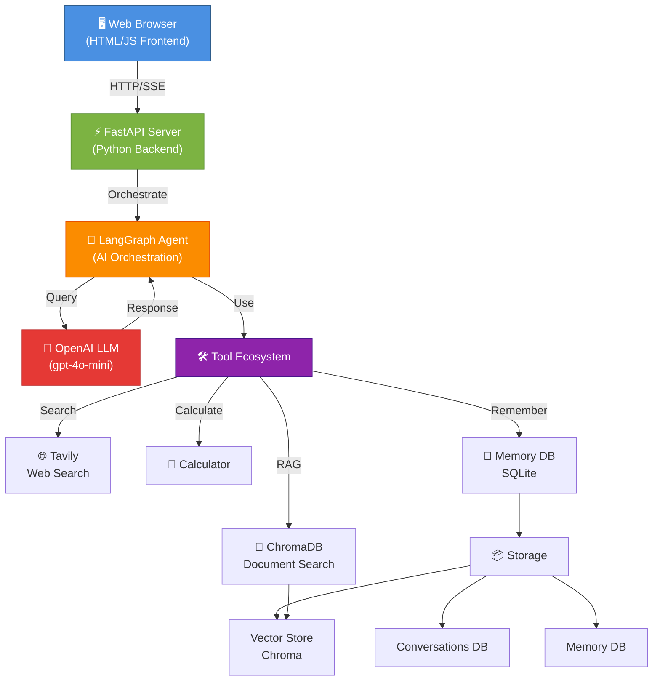
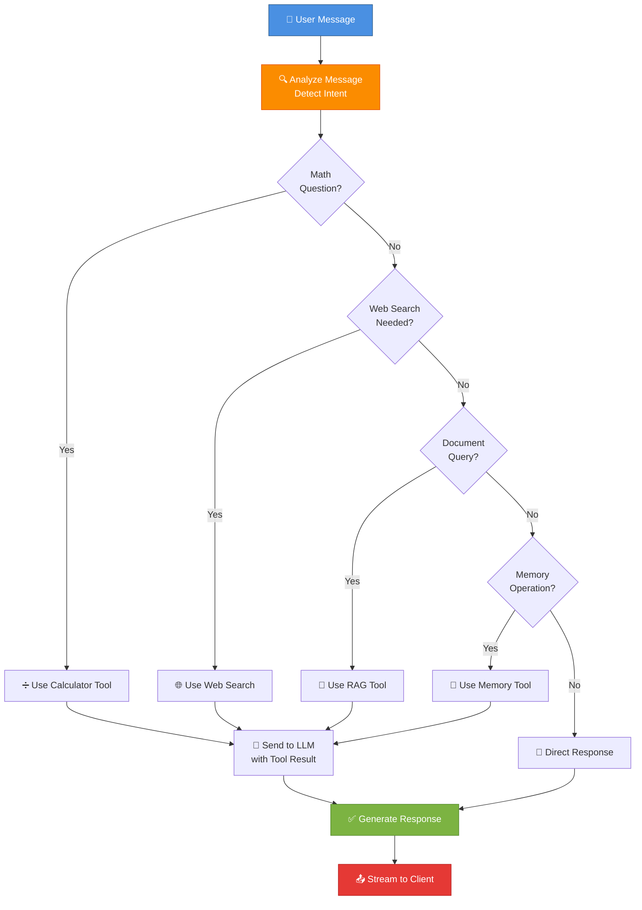

# MyGPT - Agentic AI Chatbot

An intelligent, multi-tool AI chatbot application powered by OpenAI's GPT models. MyGPT combines LangChain and LangGraph to create a sophisticated agent capable of answering questions, searching documents, retrieving web information, performing calculations, and maintaining conversation memory.

## 🌟 Features

- **🤖 Agentic AI**: Intelligent agent that decides which tools to use based on user queries
- **🔍 Document Search (RAG)**: Search and summarize uploaded PDFs, DOCX, and TXT files
- **🌐 Web Search**: Real-time information retrieval using Tavily Search API
- **💾 Memory Management**: Remember and recall user preferences and information
- **🧮 Calculator**: Perform mathematical calculations
- **💬 Conversation History**: Persistent chat history with SQLite
- **🔄 Streaming Responses**: Real-time token streaming for better UX
- **🎙️ Voice Input**: Dictate messages using browser speech recognition
- **📱 Responsive UI**: Modern dark-themed interface that works on desktop and mobile

## 🏗️ System Architecture



## 🔄 Agent Decision Flow



## 💬 Message Flow Sequence

```mermaid
sequenceDiagram
    participant Client as 🖥️ Browser
    participant FastAPI as ⚡ FastAPI
    participant Agent as 🤖 Agent
    participant Tools as 🛠️ Tools
    participant LLM as 🧠 OpenAI
    participant DB as 💾 Database

    Client->>FastAPI: POST /chat/stream<br/>(message, thread_id)
    FastAPI->>DB: Load conversation<br/>history
    DB-->>FastAPI: Previous messages
    FastAPI->>Agent: Invoke agent.stream()
    
    Agent->>LLM: Query with context
    LLM-->>Agent: Decide which tool
    
    alt Needs Tool
        Agent->>Tools: Call appropriate tool<br/>(search, calc, etc)
        Tools->>Tools: Execute tool
        Tools-->>Agent: Tool result
        Agent->>LLM: Query again<br/>with tool result
    end
    
    LLM-->>Agent: Final response
    Agent-->>FastAPI: Stream tokens
    
    par Stream to Client
        FastAPI->>Client: SSE stream<br/>(token by token)
    and Save to DB
        FastAPI->>DB: Save message<br/>to history
    end
    
    Client->>Client: Display response<br/>in real-time
    DB-->>DB: Persist conversation

    style Client fill:#4A90E2,stroke:#2E5C8A,color:#fff
    style FastAPI fill:#7CB342,stroke:#558B2F,color:#fff
    style Agent fill:#FB8C00,stroke:#E65100,color:#fff
    style LLM fill:#E53935,stroke:#B71C1C,color:#fff
    style DB fill:#8E24AA,stroke:#4A148C,color:#fff
```

## 📁 Project Structure

```
MyGPT/
├── app.py                 # Main FastAPI application & streaming endpoints
├── agent.py              # LangGraph agent orchestration
├── tools.py              # AI tool definitions (calculator, web search, RAG, memory)
├── database.py           # SQLAlchemy database models & operations
├── rag.py                # RAG implementation with ChromaDB
├── requirements.txt      # Python dependencies
├── .gitignore           # Git ignore patterns
├── .env                 # Environment variables (API keys)
│
├── templates/
│   └── index.html       # Web UI with real-time chat interface
│
├── data/
│   ├── langgraph_checkpoints.sqlite    # LangGraph checkpoints
│   ├── chatbot_memory.db               # Conversation & memory storage
│   └── chroma_db/                      # Vector store for documents
│
├── uploads/             # Uploaded documents (PDFs, DOCX, etc.)
└── __pycache__/         # Python cache
```

## 🚀 Getting Started

### Prerequisites

- Python 3.9+
- OpenAI API key
- Tavily API key (for web search)

### Installation

1. **Clone the repository**
   ```bash
   cd MyGPT
   ```

2. **Create virtual environment**
   ```bash
   python -m venv .venv
   source .venv/bin/activate  # On Windows: .venv\Scripts\activate
   ```

3. **Install dependencies**
   ```bash
   pip install -r requirements.txt
   ```

4. **Setup environment variables**
   ```bash
   cp .env.example .env
   ```
   
   Edit `.env` and add:
   ```
   OPENAI_API_KEY=your_openai_api_key
   TAVILY_API_KEY=your_tavily_api_key
   OPENAI_MODEL=gpt-4o-mini
   ```

5. **Run the application**
   ```bash
   python -m uvicorn app:app --reload
   ```
   
   The app will be available at `http://localhost:8000`

## 🛠️ Available Tools

### 1. **Calculator** 🧮
- Performs mathematical calculations
- Supports basic math and functions like `sqrt()`, `abs()`, etc.
- **Trigger**: Math expressions or questions about calculations

### 2. **Web Search** 🌐
- Real-time information retrieval via Tavily API
- Returns up to 5 relevant results
- **Trigger**: Latest news, current events, recent updates, prices

### 3. **Document Search (RAG)** 📄
- Search through uploaded documents
- Supports PDF, DOCX, TXT files
- Uses ChromaDB for semantic search
- **Trigger**: Questions about uploaded files or documents

### 4. **Memory Management** 💾
- Save user preferences and information
- Recall saved information in future conversations
- SQLite-backed persistent storage
- **Trigger**: "Remember that...", "What do you remember..."

## 🔧 Key Dependencies

| Package | Version | Purpose |
|---------|---------|---------|
| `FastAPI` | 0.136.3 | Web framework |
| `Uvicorn` | 0.48.0 | ASGI server |
| `LangChain` | 1.3.2 | LLM orchestration |
| `LangGraph` | 1.2.2 | Agent state management |
| `langchain-openai` | Latest | OpenAI integration |
| `ChromaDB` | 1.5.9 | Vector database |
| `Tavily` | 0.7.24 | Web search API |
| `SQLAlchemy` | 2.0.50 | Database ORM |

## 📊 Data Models

### Conversation
```python
- id: int (primary key)
- thread_id: str (unique, indexed)
- title: str (auto-generated from first message)
- created_at: datetime
- updated_at: datetime
```

### ChatMessage
```python
- id: int (primary key)
- thread_id: str (foreign key)
- role: str ("user" or "assistant")
- content: str (message text)
- timestamp: datetime
```

### Memory
```python
- id: int (primary key)
- thread_id: str
- key: str
- value: str (JSON serialized)
- created_at: datetime
```

## 🎯 User Interface

### Features
- **Dark theme** for reduced eye strain
- **Real-time streaming** of AI responses
- **Voice input** using Web Speech API
- **Document upload** with drag-and-drop
- **Model selector** to choose between OpenAI models
- **Conversation history** sidebar
- **Responsive design** for mobile devices
- **Tool progress indicators** showing which tools are being used

### Keyboard Shortcuts
- `Enter` - Send message
- `Shift + Enter` - New line
- 🎙️ button - Toggle voice input
- 📎 button - Upload document

## 🔐 Security & Best Practices

- Environment variables store sensitive API keys (never hardcoded)
- SQLite with proper connection handling
- Input validation for file uploads
- Error handling and graceful failure
- CORS support for production deployment
- Streaming prevents memory overload with large responses

## 📈 Performance Characteristics

- **Streaming**: Tokens are sent as soon as available (sub-100ms latency)
- **Concurrency**: Multiple independent chat sessions supported
- **Database**: SQLite suitable for up to moderate load; consider PostgreSQL for scale
- **Vector Search**: ChromaDB optimized for semantic similarity
- **Token Limit**: Context window managed per conversation

## 🚦 Deployment

### Development
```bash
python -m uvicorn app:app --reload --host 0.0.0.0 --port 8000
```

### Production
```bash
gunicorn -w 4 -k uvicorn.workers.UvicornWorker app:app
```

Consider:
- Using PostgreSQL instead of SQLite
- Deploying on Render, Railway, or AWS
- Setting up a reverse proxy (Nginx)
- Adding authentication/rate limiting
- Using Redis for session management

## 🐛 Troubleshooting

| Issue | Solution |
|-------|----------|
| API key errors | Verify `.env` file has correct keys |
| Port 8000 in use | Change port: `--port 8001` |
| Module not found | Run `pip install -r requirements.txt` |
| Database locked | Delete `data/` folder and restart |
| Streaming not working | Check browser supports ReadableStream API |

## 📚 API Endpoints

### Chat
- `POST /chat/stream` - Send message and stream response
- `POST /upload` - Upload document for RAG

### Conversation Management  
- `GET /conversations` - List all conversation threads
- `GET /history/{thread_id}` - Get conversation history
- `DELETE /conversations/{thread_id}` - Delete conversation

### Health
- `GET /health` - Server health check

## 🎓 Learning Resources

- [LangChain Documentation](https://python.langchain.com/)
- [LangGraph Guide](https://langchain-ai.github.io/langgraph/)
- [OpenAI API Docs](https://platform.openai.com/docs)
- [FastAPI Tutorial](https://fastapi.tiangolo.com/)

## 📝 License

MIT License - Feel free to use this project for personal and commercial purposes.

## 🤝 Contributing

Contributions are welcome! Please feel free to submit a Pull Request.

## 📧 Support

For issues, questions, or suggestions, please open an issue in the repository.

---

**Built with ❤️ using FastAPI, LangChain, and OpenAI**
